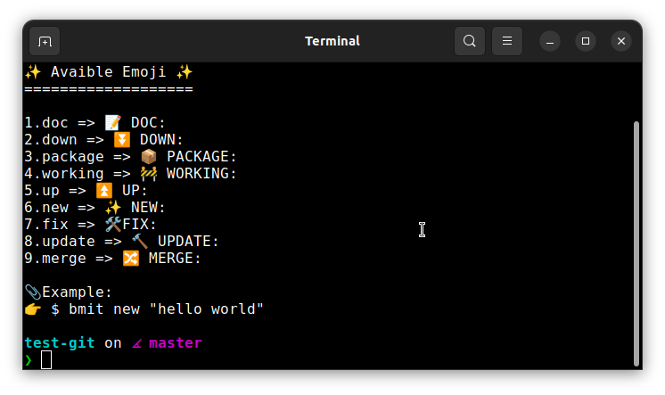
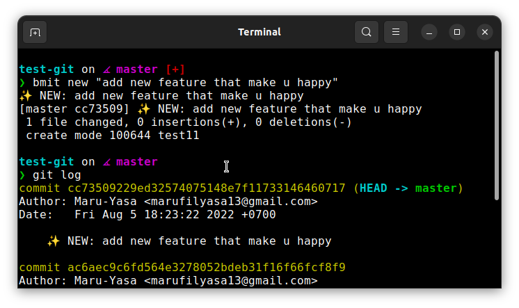

<h1 align="center">
  <a href="https://github.com/Maru-Yasa/beautiful-commit">
    <!-- Please provide path to your logo here -->
    
  </a>
</h1>

<div align="center">
  beautiful-commit
  <br />
  <a href="#about"><strong>Explore the screenshots »</strong></a>
  <br />
  <br />
  <a href="https://github.com/Maru-Yasa/beautiful-commit/issues/new?assignees=&labels=bug&template=01_BUG_REPORT.md&title=bug%3A+">Report a Bug</a>
  ·
  <a href="https://github.com/Maru-Yasa/beautiful-commit/issues/new?assignees=&labels=enhancement&template=02_FEATURE_REQUEST.md&title=feat%3A+">Request a Feature</a>
  .
  <a href="https://github.com/Maru-Yasa/beautiful-commit/issues/new?assignees=&labels=question&template=04_SUPPORT_QUESTION.md&title=support%3A+">Ask a Question</a>
</div>

<div align="center">
<br />

[](./LICENSE)

[](https://github.com/Maru-Yasa/beautiful-commit/issues?q=is%3Aissue+is%3Aopen+label%3A%22help+wanted%22)

[]()

</div>

<details open="open">
<summary>Table of Contents</summary>

- [About 📝](#about-)
- [But, why? 🤷](#but-why-)
- [Getting Started 💪](#getting-started-)
  - [Prerequisites](#prerequisites)
  - [Installation](#installation)
- [Usage ✨](#usage-)
- [Roadmap 🚧](#roadmap-)
- [Contributing 🧑‍🔧](#contributing-)
- [Authors & contributors 🙋](#authors--contributors-)
- [License 📜](#license-)

</details>

---

## About 📝

> **[?]** Beautiful Commit is a simple shell scipt based tool that  help you to make beautiful git commit messages

## But, why? 🤷

> **[?]** Git by default requires commit messages because in software development, it is practically necessary to communicate with other people, and the commit message is the best way to communicate a variety of details about the commit, including what it does, why the change is necessary, the benefits and downsides of the change, and why this change is better than alternatives. Communication is an essential skill in the workplace and in open source projects and that is also true for writing ***beautiful*** and ***usefull*** commits.

<details>

<summary>Screenshots</summary>
<br>

> **[!]**
> See Beautiful Commit in action




</details>

## Getting Started 💪 

### Prerequisites 

> **[?]**
> Beautiful Commit just need basic software like cUrl to install, and if you using windows I recomended using gitBash instead using cmd or powershell

### Installation 

> **[?]**
> Just copy and paste this command bellow to your shell, and waalaa beautiful commit ready to go 😉

```sh 
bash <(curl -s https://raw.githubusercontent.com/Maru-Yasa/beautiful-commit/main/installer.sh)
```

## Usage ✨

> **[?]**
> You can check all available emoji just type command bellow
```sh
bmit help 
```

## Roadmap 🚧

See the [open issues](https://github.com/Maru-Yasa/beautiful-commit/issues) for a list of proposed features (and known issues).

- [Top Feature Requests](https://github.com/Maru-Yasa/beautiful-commit/issues?q=label%3Aenhancement+is%3Aopen+sort%3Areactions-%2B1-desc) (Add your votes using the 👍 reaction)
- [Top Bugs](https://github.com/Maru-Yasa/beautiful-commit/issues?q=is%3Aissue+is%3Aopen+label%3Abug+sort%3Areactions-%2B1-desc) (Add your votes using the 👍 reaction)
- [Newest Bugs](https://github.com/Maru-Yasa/beautiful-commit/issues?q=is%3Aopen+is%3Aissue+label%3Abug)

## Contributing 🧑‍🔧

First off, thanks for taking the time to contribute! Contributions are what make the open-source community such an amazing place to learn, inspire, and create. Any contributions you make will benefit everybody else and are **greatly appreciated**.


Please read [our contribution guidelines](docs/CONTRIBUTING.md), and thank you for being involved!

## Authors & contributors 🙋

The original setup of this repository is by [Maru-Yasa](https://github.com/Maru-Yasa).

For a full list of all authors and contributors, see [the contributors page](https://github.com/Maru-Yasa/beautiful-commit/contributors).


## License 📜

This project is licensed under the **MIT license**.

See [LICENSE](LICENSE) for more information.
